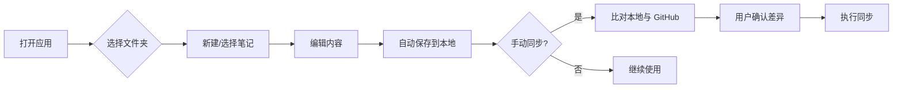

# 栈知（Gitnote）产品需求文档

## 1. 产品概述

栈知（Gitnote）是一款本地优先的笔记软件，数据主要存储在用户本地目录中，同时支持手动同步到指定的 GitHub 仓库，实现个人知识库的云端备份与多设备迁移。

产品面向习惯 Markdown 写作、希望数据可控、又需要简单云端同步的知识工作者。

## 2. 核心功能

### 2.1 功能模块

1. **三栏主界面**
   - 左栏：文件夹（工作区/频道）列表，支持自定义 Emoji 图标
   - 中栏：当前文件夹下的笔记列表，支持搜索与筛选
   - 右栏：笔记编辑器，支持 Markdown 与块编辑

2. **Emoji 图标系统**
   - 文件夹和笔记均可设置 Emoji 图标
   - 文件夹图标背景自动提取 Emoji 的平均色

3. **笔记编辑**
   - 支持 Markdown 源码模式
   - 支持块编辑器模式：段落、标题、待办清单、Callout、表格

4. **本地存储**
   - 每篇笔记保存为独立的 `.md` 文件
   - 全局配置、文件夹结构、笔记元数据保存为 `.json` 文件

5. **GitHub 手动同步**
   - 支持一次性全量同步（批量上传/下载）
   - 支持单篇笔记的上传/下载
   - 通过唯一 ID（UUID）关联本地与云端同一篇笔记

### 2.2 页面详情

| 页面 | 模块 | 功能描述 |
|------|------|----------|
| 主界面 | 文件夹栏 | 展示所有文件夹，支持新建、重命名、设置 Emoji、拖拽排序 |
| 主界面 | 列表栏 | 展示当前文件夹下的笔记，支持新建、搜索、删除 |
| 主界面 | 笔记栏 | 编辑当前笔记，切换 Markdown/块编辑器，显示标题、标签、Emoji |
| 设置页 | 同步配置 | 配置 GitHub 仓库、Token、分支、同步目录 |
| 设置页 | 外观配置 | 主题、字体、编辑器偏好 |

## 3. 核心流程

### 3.1 新建并编辑笔记

用户打开应用 → 在左栏选择文件夹 → 在中栏点击新建笔记 → 输入标题 → 在右栏编辑内容 → 自动保存到本地 Markdown 文件。

### 3.2 GitHub 同步

用户进入设置 → 配置 GitHub Token 与仓库 → 返回主界面 → 点击同步按钮 → 应用比对本地与云端文件 → 生成差异列表 → 用户确认后执行上传/下载。

### 3.3 流程图

## 4. 用户界面设计

### 4.1 设计风格

- **整体风格**：Apple 原生风格，干净、通透、低饱和
- **主色调**：浅灰白背景（`#FAFAFA` / `#FFFFFF`），深色文字（`#1D1D1F`）
- **强调色**：蓝色（`#007AFF`）用于按钮、链接、选中态
- **边框与分隔线**：极浅灰（`#E5E5E5` / `#F0F0F0`），1px 细线
- **字体**：系统字体栈，优先 `-apple-system, BlinkMacSystemFont, "SF Pro Text", "Segoe UI"`
- **图标**：Emoji 作为内容图标，Lucide 作为 UI 图标
- **圆角**：卡片/按钮 8px，Emoji 背景 12px，大封面 20px

### 4.2 布局规格

- 三栏布局，左栏与中栏宽度相等且较窄（约 260px），右栏自适应剩余宽度
- 三栏之间以 1px 竖线分隔
- 左栏顶部显示「频道」标题与新建按钮
- 中栏顶部显示当前文件夹 Emoji、名称与搜索框
- 右栏顶部显示笔记 Emoji、标题、标签、工具栏

### 4.3 页面设计概览

| 页面 | 模块 | UI 元素 |
|------|------|---------|
| 主界面 | 文件夹栏 | 搜索框、文件夹列表（Emoji + 名称）、新建文件夹按钮 |
| 主界面 | 列表栏 | 文件夹封面、笔记卡片列表、搜索框 |
| 主界面 | 笔记栏 | Emoji 选择器、标题输入、标签编辑、块编辑器工具栏、编辑区 |
| 设置页 | 同步配置 | GitHub Token、仓库、分支、同步目录输入框 |
| 设置页 | 外观配置 | 主题切换、字体大小滑块 |

### 4.4 响应式设计

- 桌面优先，默认窗口宽度 1280px 以上显示完整三栏
- 窗口缩小时优先压缩右栏，再隐藏左栏（可通过汉堡菜单唤出）
- 触摸设备优化：增大点击区域至 44px 以上

## 5. 非功能性需求

- 自动保存间隔 500ms，防抖处理
- 本地数据不可加密，以普通 Markdown/JSON 存储
- 同步冲突时保留本地版本，并在文件名后追加冲突标记
- 支持离线使用，同步仅在用户主动触发
