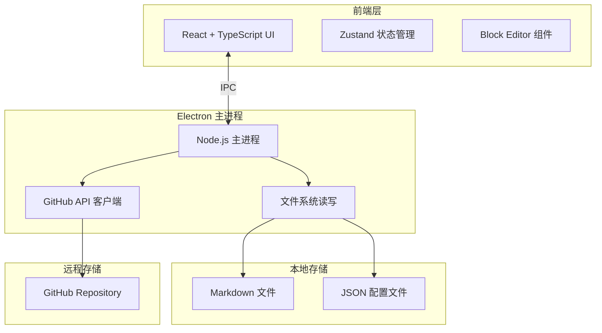
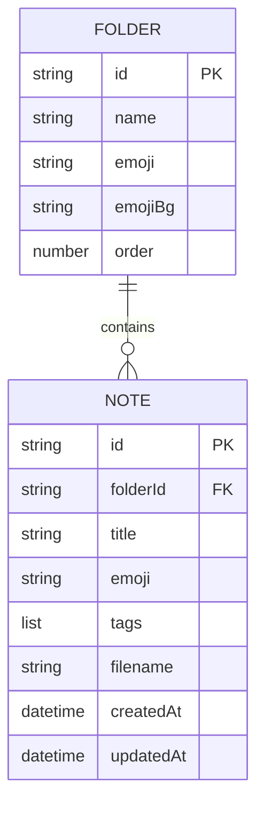

# 栈知（Gitnote）技术架构文档

## 1. 架构设计



## 2. 技术选型

- **前端框架**：React 18 + TypeScript
- **构建工具**：Vite
- **样式方案**：Tailwind CSS
- **状态管理**：Zustand
- **桌面壳**：Electron
- **块编辑器**：Slate.js（灵活可控，适合自定义 Block）
- **Markdown 转换**：remark / unified 生态
- **图标**：Lucide React
- **HTTP 客户端**：原生 fetch（Electron 主进程）

## 3. 项目结构

```
Gitnote/
├── .trae/documents/          # 产品文档
├── electron/                 # Electron 主进程与预加载脚本
│   ├── main.ts
│   └── preload.ts
├── src/
│   ├── components/           # React 组件
│   │   ├── layout/           # 三栏布局组件
│   │   ├── editor/           # 编辑器相关
│   │   └── ui/               # 通用 UI 组件
│   ├── hooks/                # 自定义 Hooks
│   ├── stores/               # Zustand stores
│   ├── lib/                  # 工具函数
│   ├── types/                # TypeScript 类型
│   └── App.tsx
├── notes/                    # 本地笔记数据（运行时生成）
├── package.json
├── tsconfig.json
├── vite.config.ts
└── tailwind.config.js
```

## 4. 数据模型

### 4.1 配置文件 `config.json`

```json
{
  "version": "1.0.0",
  "theme": "light",
  "fontSize": 16,
  "github": {
    "token": "ghp_xxx",
    "owner": "username",
    "repo": "gitnote-sync",
    "branch": "main",
    "syncDir": "notes"
  },
  "folders": [
    {
      "id": "uuid",
      "name": "Get Started",
      "emoji": "☂️",
      "emojiBg": "#F4D03F",
      "order": 0
    }
  ]
}
```

### 4.2 笔记元数据 `notes-meta.json`

```json
{
  "notes": [
    {
      "id": "uuid",
      "folderId": "uuid",
      "title": "Playground Page",
      "emoji": "🦔",
      "tags": ["tag"],
      "createdAt": "2026-07-04T12:00:00Z",
      "updatedAt": "2026-07-04T12:00:00Z",
      "filename": "playground-page.md"
    }
  ]
}
```

### 4.3 Markdown 文件结构

每篇笔记保存为独立的 Markdown 文件，文件头采用 YAML Front Matter：

```markdown
---
id: uuid
folderId: uuid
title: Playground Page
emoji: 🦔
tags:
  - tag
createdAt: 2026-07-04T12:00:00Z
updatedAt: 2026-07-04T12:00:00Z
---

# Playground Page

正文内容...
```

### 4.4 ER 图



## 5. 同步策略

### 5.1 唯一标识

每篇笔记与每个文件夹均使用 UUID 作为唯一标识，确保本地与 GitHub 端能正确对应。

### 5.2 批量同步流程

1. 读取本地 `config.json` 与 `notes-meta.json`
2. 调用 GitHub API 获取远程对应目录下的所有 Markdown 与 JSON 文件
3. 按 `id` 匹配本地与远程笔记
4. 生成差异列表：
   - 仅本地存在 → 上传
   - 仅远程存在 → 下载
   - 双方均存在 → 比较 `updatedAt`，以较新的为准；若时间相同则保留本地并标记冲突
5. 用户确认后执行批量上传/下载

### 5.3 单篇同步流程

1. 用户在中栏或编辑器中选择「同步此笔记」
2. 应用读取该笔记的 `id` 与 `updatedAt`
3. 查询远程是否存在同名/同 ID 文件
4. 根据时间戳决定上传或下载
5. 完成后刷新本地元数据

## 6. API 定义

### 6.1 IPC 通道

| 通道名 | 方向 | 参数 | 返回 |
|--------|------|------|------|
| `fs:readConfig` | Renderer → Main | - | `Config` |
| `fs:writeConfig` | Renderer → Main | `Config` | `boolean` |
| `fs:readNote` | Renderer → Main | `noteId: string` | `{ meta: NoteMeta, content: string }` |
| `fs:saveNote` | Renderer → Main | `{ meta: NoteMeta, content: string }` | `boolean` |
| `fs:listNotes` | Renderer → Main | `folderId?: string` | `NoteMeta[]` |
| `fs:deleteNote` | Renderer → Main | `noteId: string` | `boolean` |
| `github:syncAll` | Renderer → Main | - | `SyncResult` |
| `github:syncNote` | Renderer → Main | `noteId: string` | `SyncResult` |
| `github:testConnection` | Renderer → Main | - | `boolean` |

### 6.2 TypeScript 类型

```typescript
interface Config {
  version: string;
  theme: 'light' | 'dark';
  fontSize: number;
  github?: GitHubConfig;
  folders: Folder[];
}

interface Folder {
  id: string;
  name: string;
  emoji: string;
  emojiBg: string;
  order: number;
}

interface NoteMeta {
  id: string;
  folderId: string;
  title: string;
  emoji: string;
  tags: string[];
  createdAt: string;
  updatedAt: string;
  filename: string;
}

interface GitHubConfig {
  token: string;
  owner: string;
  repo: string;
  branch: string;
  syncDir: string;
}

interface SyncResult {
  success: boolean;
  uploaded: number;
  downloaded: number;
  conflicts: string[];
  error?: string;
}
```

## 7. 安全与隐私

- GitHub Token 仅存储在本地 `config.json` 中，不经过任何第三方服务
- 所有笔记数据以明文 Markdown/JSON 存储，用户可自行选择加密盘或私有仓库保护隐私
- 同步过程仅使用 GitHub REST API，不引入额外后端
